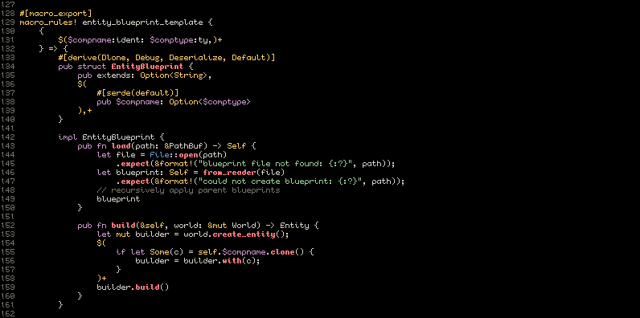
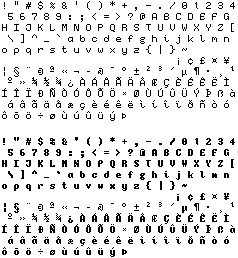

# viii

this is a small 8pt .bdf font i made for coding, inspired by Tewi, some quirks in my own handwriting, and other bitmap fonts i've seen and used. right now it only uses the ISO 8859-1 extended ASCII table, but i plan to incorporate more as well.

right now i'm only providing BDF files but i'll also include OTF once it's all finished. you can use fontforge to convert them, if you want.
